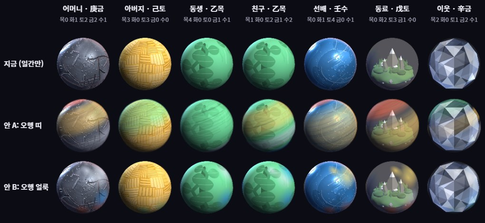
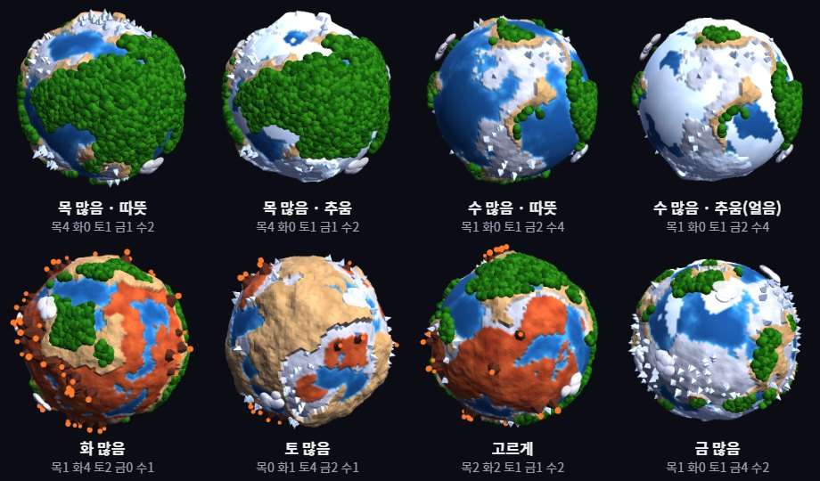
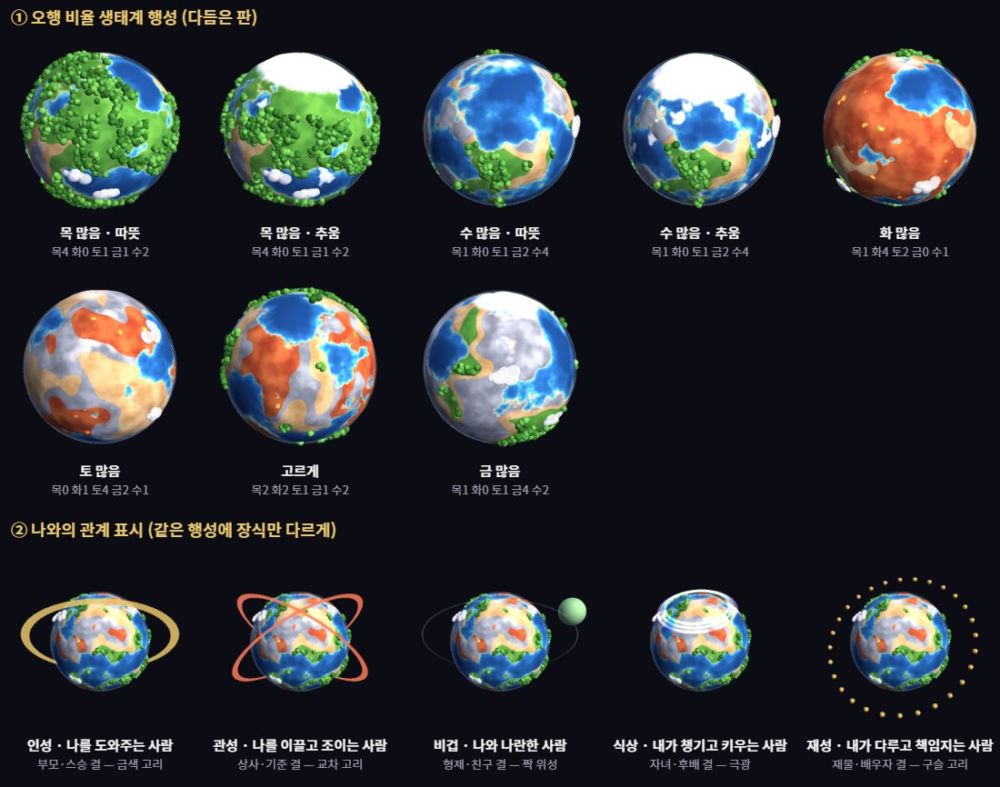
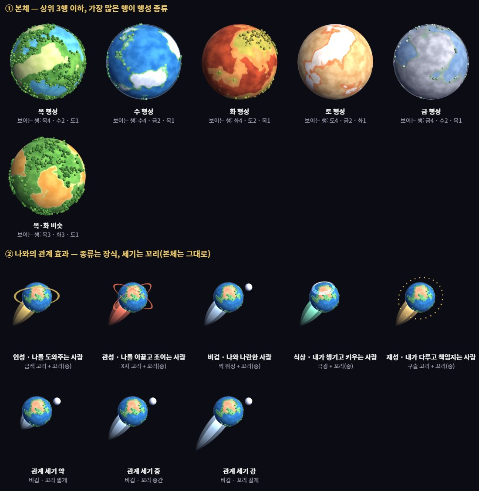
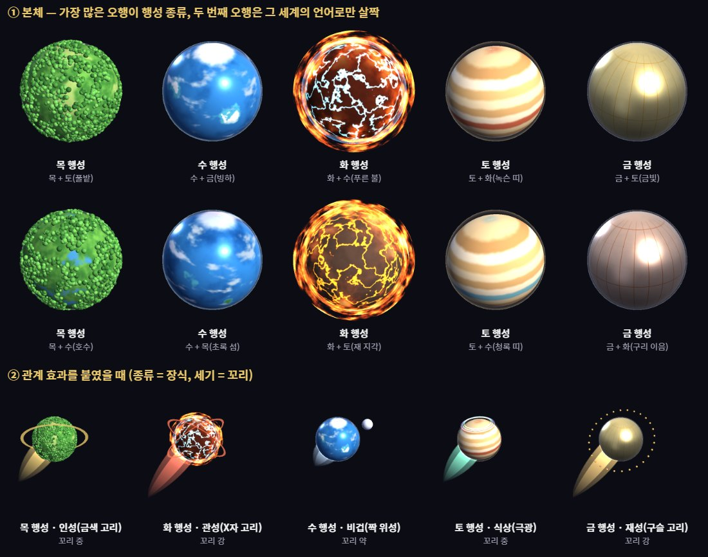

# U2 · 폰에서 홈 열기 + 오행 비율 행성·가독성 검토 [2026-09-17]

**실행 모델**: Opus 5. **적정성**: 맞았다 — 구현은 작고, 나머지 둘은 판단(방향 제안)이다.
**다음 회차 모델 [권장]**: 결정 뒤 구현이면 Sonnet 5(가독성 재배치는 문장 분류 판단이 있어 Opus 5도 가능).

**비용 수준**: 중 — 폰 홈 소규모 수정 + 시안 렌더 + 패널 글자 정량.

---

## 1. 폰에서 홈 보기 — 구현
- 아래 태그바 맨 앞 **「은하 ☰」** — 은하 화면에서 누르면 홈이 열린다(그룹·가상 성계 화면에서는 종전대로
  은하로 돌아간다 → 한 번 더 누르면 홈). 데스크톱도 같은 동작.
- 홈에 제목 `내 은하`(h2)를 넣어 폰 패널 머리에 제목이 뜨게 했다.
- **실측(375×812)**: 그룹 화면 → 「은하」 → 패널 닫힘·은하 → 「은하」 → 홈 열림, 머리 제목 "내 은하".
  예시 화면 접기 애니메이션 도중 누른 첫 시도는 열리지 않았다(다시 누르면 정상) — 실사용에서 드문 겹침.
- 자가진단 97/97.

## 2. 오행 비율로 행성을 다양하게 — 가능하다 (시안)

**지금**: 행성 모양은 **일간(태어난 날 윗글자) 10종**뿐이라, 같은 일간이면 똑같다(예시의 동생·친구 둘 다 乙목).
**시안**: 여덟 글자 오행 개수(`sajuElements`)를 행성 겉에 한 겹 더 씌웠다.

- **안 A · 오행 띠** — 개수 비율만큼의 폭으로 가로 띠(목성 무늬). 동생(목4 금1 수1)과 친구(목1 토2 금1 수2)가
  **확실히 달라진다.** 대신 일간 모양(금속 결·나무 무늬)이 흐려진다.
- **안 B · 오행 얼룩** — 글자 수만큼 색 얼룩. 일간 모양은 살지만 **차이가 약하다.**
- **권장 [권장]: 안 A를 연하게(투명도 .55 → .3 안팎) + 띠 순서를 개수 많은 것부터** — "겉모습 = 일간,
  무늬 = 오행 비율"로 두 층이 모두 읽히는 선. 경우의 수: 일간 10 × 오행 분포(8글자를 5칸에 나누는 수 수백) →
  사실상 사람마다 다르다.
- 주의: 은하 조망에서 행성은 3~20px라 띠가 거의 안 보인다 — **효과는 확대·초상·그룹 화면에서** 난다.
  비용은 행성마다 텍스처 한 장(512×256) 추가, 초상 캐시 키에 오행 분포를 넣어야 한다.

### 2-추가. 사용자 레퍼런스 뒤 — "작은 지구(생태계) 행성" 시안 [같은 날]

사용자가 참고 이미지 4장(숲이 솟은 작은 지구)을 주며 "목의 행성은 이런 것, 물인데 차가우면 얼음"이라고 했다.
**방식이 띠·얼룩(표면에 색 칠하기)이 아니라 "표면 + 표면 밖"(지형 높낮이 + 솟은 나무 덩이)** 이라는 뜻이라
CLAUDE.md "은유를 그림으로 옮길 때 — 방식부터 맞춘다"에 따라 방식을 바꿔 다시 그렸다.

- **대응**: 목=숲(뭉게 나무 덩이가 솟음) · 수=바다(추우면 극지방+유빙) · 토=흙·산(가장 높게 솟음) ·
  금=회색 바위+흰 결정 · 화=붉은 땅+화산. **면적 = 여덟 글자 오행 개수 비율**(바다는 수 비율, 땅 넷은 나머지 비율).
- **추위**: 같은 분포(목4 토1 금1 수2)라도 춥게 하면 흰 얼음이 덮인다(1행 1·2열, 2열 3·4열 비교).
  추위 값은 시안에서 손으로 넣었다 — 실제로는 **태어난 달(겨울 亥子丑 / 여름 巳午未)** 로 정하는 것 [권장, 조후 규칙 확인 필요].
- **사람마다 다르다**: 지도 모양은 사람별 씨앗(생년월일)으로 정해져 같은 분포여도 대륙 모양이 다르다.
- **비용**: 한 장 약 0.13~0.15초(1200×640 창, 512px 렌더). 일간 10종 캐시가 아니라 **사람마다 한 장**이 된다.
- **남은 문제(시안 수준)**: 화산 불씨가 테두리에서 점처럼 떠 보임, 결정이 설탕 가루처럼 보임, 일간(甲 나무·丁 촛불 등)
  은유와 어떻게 합칠지 미정 — **일간은 행성 한가운데 상징(가장 큰 나무 한 그루·산 하나 등)으로 남기는 안** [권장].
- 코드: `tools/proto-biome-planet.js`(앱이 읽지 않음).

### 2-추가2. "지저분하다" 피드백 뒤 2판 + 관계 표시 시안 [같은 날]

**무엇이 지저분했나 → 고친 방식**
- 꼭짓점마다 색을 칠해 경계가 계단처럼 각졌다 → **픽셀 단위 텍스처(768×384)** 로 칠해 해안선이 매끈하다.
- 뾰족한 결정·떠다니는 화산 점 → **없앴다.** 금은 회색 고지대+옅은 눈, 화는 붉은 땅+은은한 용암 줄기(발광).
- 나무가 구슬처럼 흩어짐 → **노이즈로 모인 숲 덩이**(빈터가 생긴다), 색 5단.
- **대기 테두리**(가장자리 빛) 추가, 구름은 적고 납작하게.
- 비용: 한 장 약 0.25초(1200×640 창). 사람마다 한 장이라 캐시하면 문제없다.

**관계 표시 — 나 기준 십신 다섯 갈래(계열)를 행성 둘레 장식으로** [권장]
| 계열(나 기준) | 뜻 | 장식 | 기존 규칙과의 관계 |
|---|---|---|---|
| 인성 | 나를 도와주는 사람(부모·스승 결) | 금색 고리 | 지금 "고리 1개 = 나를 생"과 **같은 뜻** — 그대로 이어진다 |
| 관성 | 나를 이끌고 조이는 사람(상사·기준 결) | X자 교차 붉은 고리 | 지금 "고리 2개 교차 = 나를 극"과 **같은 뜻** |
| 비겁 | 나와 나란한 사람(**형제·친구 결**) | 짝 위성 하나 | 새로 |
| 식상 | 내가 챙기고 키우는 사람(자녀·후배 결) | 극지방 극광 | 새로 |
| 재성 | 내가 다루고 책임지는 사람(재물·배우자 결) | 구슬 고리 | 새로 |
- **쓰지 않는 것**: 꼬리·먹구름·번개는 기획서(`service-plan-draft.md` §8.2·§8.4)가 **시기(운) 표시**로 비워 뒀다 —
  관계(평생 고정)에 쓰면 나중에 운세를 붙일 자리가 없어진다. 대운·연운이 붙을 때 번개(충 활성)·먹구름(일시 압박)으로 쓴다.
- 지금의 "고리 3개 = 소속이 넓다"는 뜻이 관계가 아니라서 **뺀다** [권장](기획서 §8.3도 제거 권장).

**형·동생·언니·누나·오빠 — 사주로는 못 정한다**
- 사주의 비겁은 "형제 같은 결"이지, 실제로 형인지 동생인지는 알려 주지 않는다.
- 제안 [권장]: ① 사람마다 **호칭 칸(선택)** — 엄마·형·누나·동기… ② 호칭을 안 넣었고 **같은 가족 그룹**이면
  생년월일·성별로 **자동 제안**(나보다 나이 많은 남자 → 나(남)면 "형", 나(여)면 "오빠"). ③ 호칭은 행성 이름표
  아랫줄에 표시 — 장식은 사주 결, 글자는 실제 호칭으로 역할을 나눈다.
- 호칭을 저장하려면 저장 형식 변경(`SAVE_VER` 6)이 필요하다.

### 2-추가3. "프랑켄슈타인 같다" 피드백 뒤 3판 — 본체와 관계 효과를 가른다 [같은 날]

**사용자 원칙(확정)**: *행성 원본(본체)은 변하지 않고, 나와의 관계에 따라 달라지는 것은 이펙트로 본다.*
사용자 제안: 오행은 가장 많은 3행 이하만 · 혜성 꼬리를 단계(길고 짧게)로 쓴다.

**본체(누가 보든 같다)**
- 상위 3행 이하만. **가장 많은 행이 "행성 종류"**(숲·바다·화산·사막·은빛)를 정하고 넓이의 62%를 차지,
  나머지 둘은 개수 비율로 38%를 나눈다.
- **색이 싸우지 않게** 행성 종류마다 팔레트 한 벌을 두고, 부 원소도 그 세계의 명도·채도대로 칠한다
  (예: 화산 행성 속 물 = 보랏빛 호수). 물은 늘 가장 낮은 곳, 화·금은 높은 곳.
- 동률은 목·화·토·금·수 순서로 자른다 [권장].

**관계 효과(나 기준 — 보는 사람에 따라 다르다)**
- **종류 = 장식**: 인성 금색 고리 · 관성 X자 고리 · 비겁 짝 위성 · 식상 극광 · 재성 구슬 고리(2판과 같음).
- **세기 = 혜성 꼬리 3단계**(짧게·중간·길게, 관계 색). 세기 산정 [권장]: 상대 여덟 글자를 내 일간 기준으로 셌을 때
  그 관계 갈래가 몇 글자인가(`relSpread` — 이미 있는 계산) → 1~2 약 · 3~4 중 · 5 이상 강.
- **충돌 1건**: 혜성 꼬리는 지금 **가상 성계 복제본 표시**로 쓰고 있다(`index.html` 가상 성계 클론 `tail`,
  `GALAXY-LAYOUT-SPEC.md` §5.5). 꼬리를 관계 세기로 쓰면 가상 성계 표시는 **점선 테두리** 같은 다른 모양으로 바꿔야 한다 [권장].
- **남겨 두는 것**: 번개·먹구름은 운(시기) 효과로 — 대운·연운이 붙을 때 "이번 달 부딪힘/압박"에 쓴다.
- 기존 "고리 3개 = 소속이 넓다"는 관계가 아니라 **폐지** [권장].

### 2-추가4. 4판 — "행성 종류" 방식 [같은 날]

사용자: "화·토는 피부병 걸린 행성 같고 금은 금행성 같지 않다. 화는 불길에 휩싸인 행성, 토는 토성 같거나 사막,
금은 진짜 금속 행성이어도 된다. 여전히 전체적으로 어울리지 않는다."
→ **원인은 방식이었다**: 한 표면에 여러 지형을 나눠 칠하는 한 "얼룩"에서 못 벗어난다(CLAUDE.md "세 번 실패하면
방식을 의심한다"). **가장 많은 오행 하나가 행성의 재질·형태 자체를 정하는 방식**으로 바꿨다.

| 행성 종류 | 모습 | 두 번째 오행의 표현(그 세계의 언어로만) |
|---|---|---|
| 목 | 숲 덩이로 덮인 행성 | 수=호수 · 토=풀밭 · 화=단풍 · 금=바위 산등성이 |
| 수 | 바다 행성 + 얇은 구름 | 목=초록 섬 · 토=모래섬 · 금=빙하 · 화=산호빛 여울 |
| 화 | 검은 지각의 빛나는 균열 + **불길 껍질 3겹**(셰이더) | 수=푸른 불 · 금=백열 · 토=잿빛 지각 |
| 토 | **토성 같은 줄무늬 가스 행성**(약간 납작) | 띠 하나의 색 — 목=올리브 · 수=청록 · 화=녹슨 · 금=은빛 |
| 금 | **반사 금속 + 판 이음선**(밝은 스튜디오 반사 환경을 따로 구움) | 이음·색조 — 화=구리 · 토=금빛 · 수=푸른 강철 · 목=청록 녹 |

- 실측으로 잡은 것: 금속은 성운 반사 환경에서 **검은 거울**이 됐다 → 전용 밝은 반사 환경. 화산 균열 문턱이 낮아
  표면 전체가 번쩍였다 → 문턱을 올려 가는 줄기로.
- 비용: 10장 2.4초(한 장 약 0.24초, 1200×900 창) — 사람마다 한 번 굽고 캐시.
- 관계 효과(3판의 장식·꼬리)를 그대로 얹어도 어울린다(아래 줄).
- 코드: `tools/proto-planet-v4.js`(앱이 읽지 않음), 효과는 `tools/proto-biome-planet-v3.js`의 `REL_FX`.

## 3. 글이 안 읽힌다 — 진단과 제안

**실측(예시 인물 1명 인물 패널, 모두 펼침 2,710자)**
- 그 사람만의 해석: 1,530자(56%)
- 공통 설명(표 읽는 법·용어 풀이·판정 근거): 691자(26%), 접힘 손잡이 10개
- 공통 안내 문구: 220자(8%)
- 해석 문장 안 사주 용어: 12회(괄호 병기 6회)

**문제**: 공통 설명과 개인 해석이 **같은 글꼴·같은 색·같은 흐름**으로 섞여 있다. 사주 표(근거)가 해석보다
위에 있어서 처음 보는 사람이 "표 → 표 읽는 법 → 판정 근거"를 지나야 자기 이야기에 닿는다.

**제안 [권장] — 세 층으로 가른다**
1. **맨 위 = 그 사람 이야기**: 핵심 한 줄 요약 + 해석 카드(지금 문장 그대로). 밝고 큰 글씨.
2. **용어는 본문에서 뺀다**: "스스로 버티는 기운(비겁)"의 괄호를 없애고, 용어는 점선 밑줄로 두고 누르면
   짧은 풀이가 뜬다(한 곳에서 관리하는 용어 사전). 문장이 짧아지고 공통 설명이 반복되지 않는다.
3. **맨 아래 = 「근거 보기」 한 덩이(기본 접힘)**: 사주 표·기운 세기 판정·표 읽는 법. 회색·작은 글씨·
   "읽는 법" 아이콘으로 **개인 해석과 모양부터 다르게** 한다.

- 대안: 탭(「이야기 / 근거」)으로 나누기 — 더 깔끔하지만 근거를 찾는 사람이 한 번 더 눌러야 한다.
- 문장 자체는 안 바꾼다(A6에서 검수 끝난 원고) — **자리와 모양만** 바꾼다.

## 실기기 재확인 목록
- 폰에서 태그바 「은하 ☰」를 두 번 눌러 홈이 뜨는지.

## 사용자 결정 필요 — 2건
1. **오행 행성**: ~~안 A(띠)를 연하게 [권장] / 안 B(얼룩) / 지금대로~~ → [같은 날 정정] 사용자 레퍼런스로
   **생태계 행성**이 방향. 남은 선택: 일간 은유를 ⓐ 한가운데 상징으로 남긴다 [권장] / ⓑ 버리고 생태계만 /
   ⓒ 은하 조망은 지금 행성, 확대·초상만 생태계.
2. **가독성**: 세 층 재배치(이야기 → 용어 풀이 팝업 → 근거 접힘) [권장] / 탭으로 나누기.
3. **[추가] 관계 장식 다섯 가지**(위 표) 채택 여부 · "고리 3개 = 소속 넓음" 폐지 여부 [권장: 둘 다 예].
   → [3판] 꼬리 = 관계 세기 3단계 채택 시 **가상 성계 표시를 점선 테두리로 교체** [권장].
   → [3판] 본체의 일간 상징(甲 나무 등)은 ⓐ 행성 한가운데 작은 상징으로 [권장] / ⓑ 뺀다.
4. **[추가] 호칭 칸 + 가족 그룹 자동 제안** [권장] / 호칭 없이 장식만.

## 그냥 진행함
- 폰 홈 입구를 새 버튼 대신 **이미 있는 「은하」에 얹었다** — 화면에 버튼을 늘리지 않고, "은하 전체"와 뜻이 같다.
- 시안은 **코드에 넣지 않고** 브라우저에서만 그려 그림으로 남겼다(결정 전이라).

## 로컬 서버
8935 **내렸다**.
